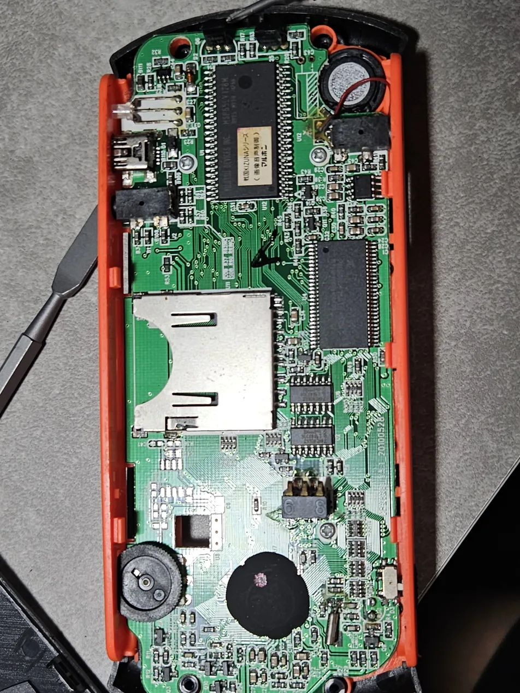
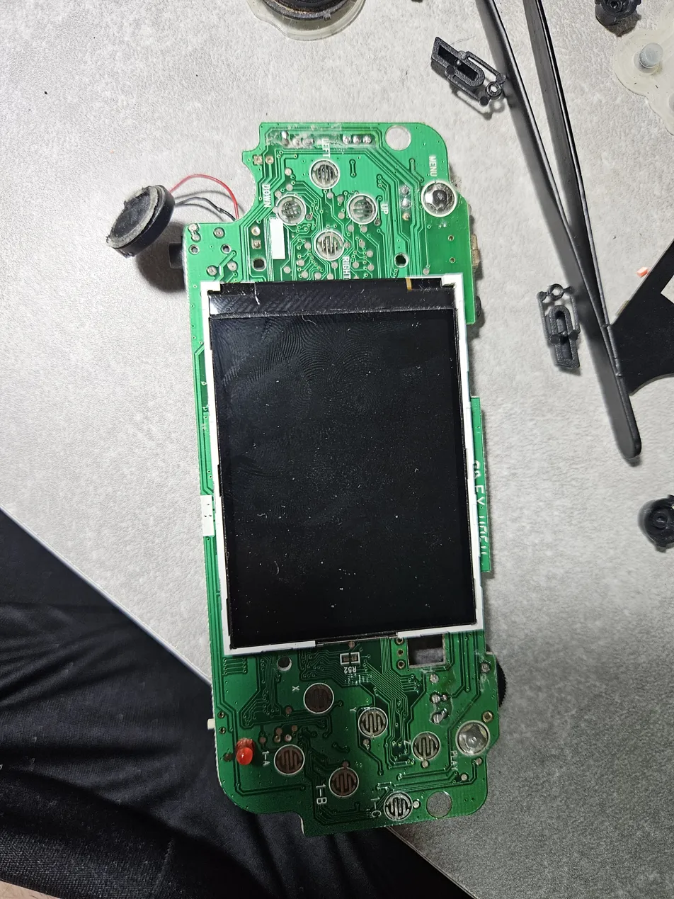
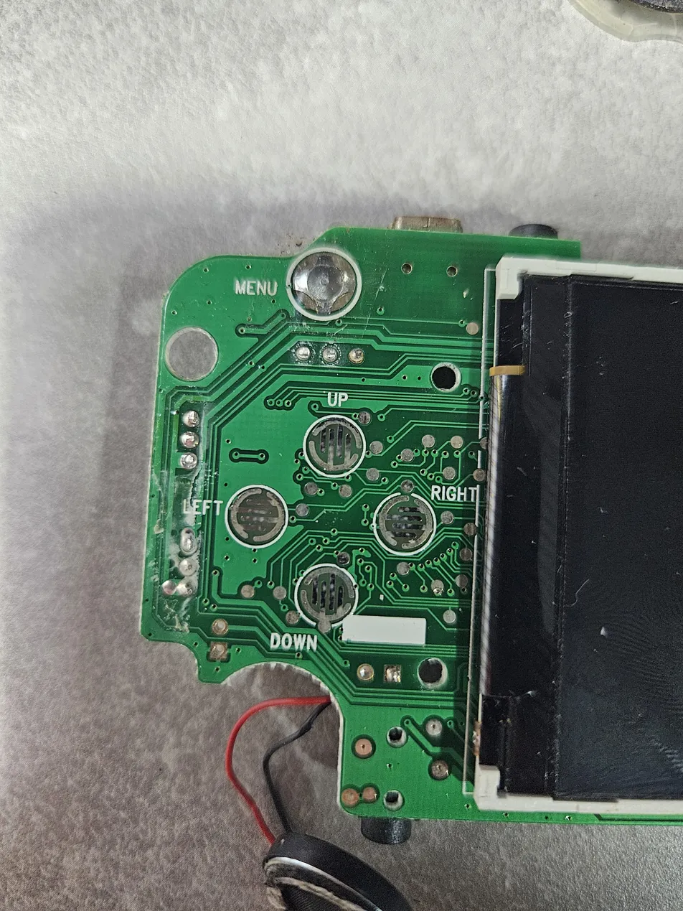
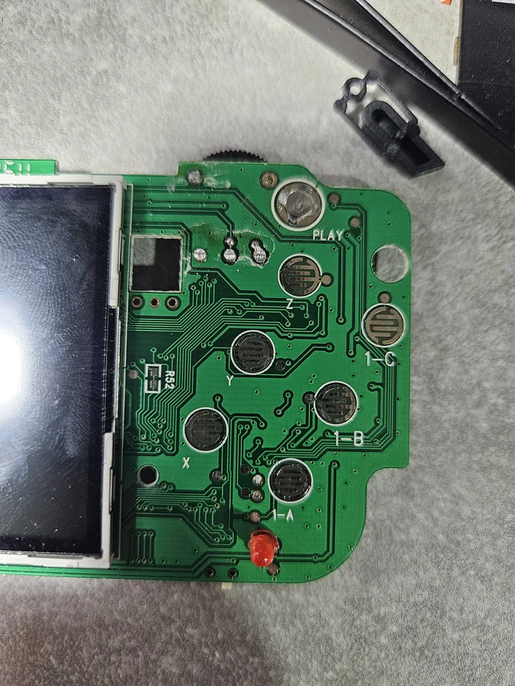
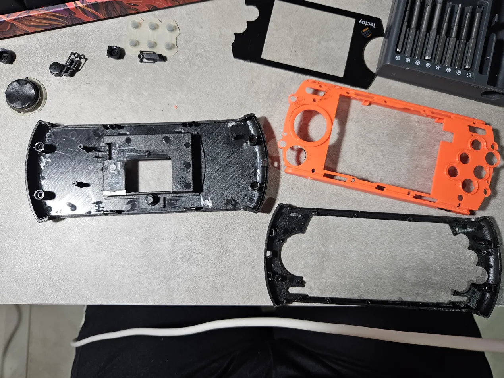
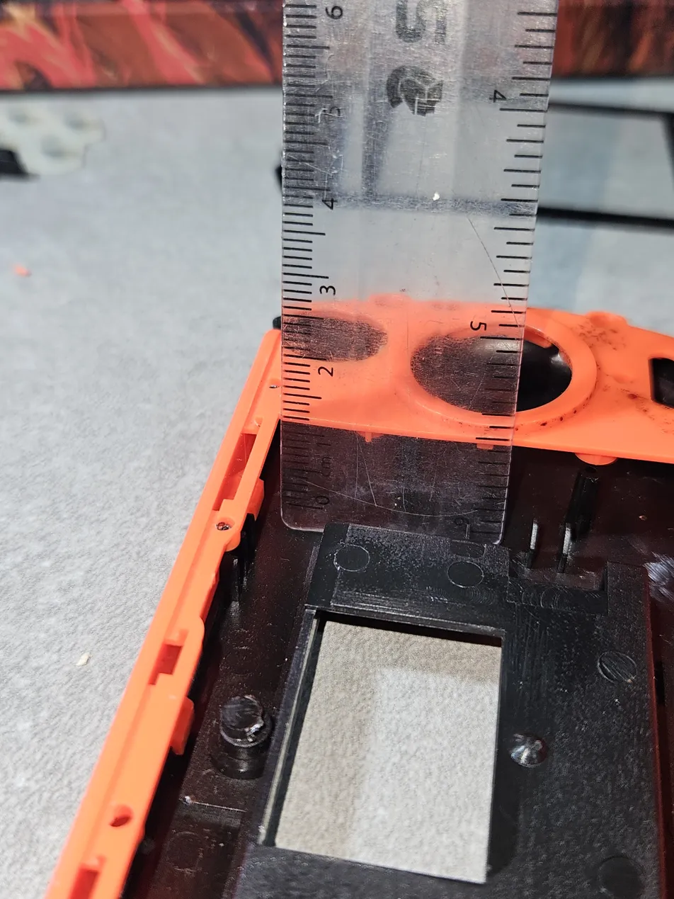

# Retro Handheld Mod

A personal project to repurpose a Tectoy handheld console
into a functional Raspberry Pi-based emulation device.

## Motivation

Built as an anniversary gift for my girlfriend — combining a sentimental object
with real embedded systems engineering. The goal was to create something
meaningful that could also serve as a functional device.

## Goals

- Reuse original casing and buttons
- Integrate Raspberry Pi Zero 2W
- Run Linux-based emulation software
- Document the full process as a learning experience

## Hardware (original)

- Console: Tectoy Mega Drive Portátil
- PCB: GP2628 V5.1 20000329
- SoC: Sengoku KIZUNA Series (Maruho) — proprietary, not reusable

## Internal Dimensions

| Measurement | Value |
|-------------|-------|
| Length | ~140mm |
| Width | ~50mm |
| Depth | ~15mm |

## Components

### Reused
- Casing (front and back shells)
- D-pad and action buttons (UP, DOWN, LEFT, RIGHT, MENU, X, Y, Z, 1-A, 1-B, 1-C, PLAY)
- Reset switch
- Speaker

### Replaced
- PCB (original discarded)
- Display (original proprietary flat cable, incompatible)
- Battery (original NP60-2 3.7V 750mAh, insufficient capacity)

## New Components (planned)

- Raspberry Pi Zero 2W
- Display 2.8" SPI (ILI9341)
- LiPo battery + TP4056 charging module
- MicroSD 16GB+
- PAM8403 mini amplifier

## Status

- [x] Disassembly and hardware inspection
- [ ] Component sourcing
- [ ] GPIO mapping
- [ ] Display integration
- [ ] Software setup
- [ ] Final assembly

## Build Log

### Day 1 — Disassembly and inspection

Disassembled the console completely. The original PCB (GP2628 V5.1) runs a
proprietary Maruho SoC (Sengoku KIZUNA Series) and is not reusable.

All button contacts are labeled directly on the PCB, which simplified mapping.
The casing has enough internal space (~140mm x 50mm x 15mm) to fit the
Pi Zero 2W, a flat LiPo battery, and wiring without structural modification.

Components confirmed for reuse: casing, button membranes, MENU and PLAY
tactile switches, slide switch, speaker, and LED indicator.

Components discarded: original PCB, display (proprietary flat cable,
incompatible), battery (NP60-2 3.7V 750mAh, insufficient capacity).

New components ordered — delivery expected between May 6–15.

**PCB overview:**

**Button contacts (directional):**

**Button contacts (action):**

**Casing — all parts:**

**Internal dimensions:**

Components confirmed for reuse: casing, all buttons, volume wheel,
reset switch, and speaker.

Next step: source components and map GPIO pins.

### Day 2 — Button mapping

Mapped all button contacts using a VC830L multimeter in resistance mode (2k scale).
Used the speaker's black wire as GND reference. Values close to zero indicate
GND, values above 1 indicate signal.

| Button | GND | Signal |
|--------|-----|--------|
| MENU | outer ring | inner contact |
| PLAY | outer ring | inner contact |
| X | left pad | right pad |
| Z | left pad | right pad |
| Y | right pad | left pad |
| 1-A | right pad | left pad |
| 1-B | right pad | left pad |
| 1-C | right pad | left pad |
| UP | top pad | bottom pad |
| DOWN | top pad | bottom pad |
| LEFT | left pad | right pad |
| RIGHT | left pad | right pad |
| LED | right pad | pad near R30 |
| SLIDE SWITCH | all pins LOW (right position = on) | — |

**Decisions made:**

- Volume wheel (VR1) discarded — Pi Zero 2W has no native ADC input.
Volume control will be handled in software.
- AVOUT port discarded — analog video output, not needed.
- Original USB and display connector discarded.
- Holes left by VR1 and AVOUT will be covered with vinyl adhesive from inside.

GPIO pin assignment will be defined once the Pi Zero 2W arrives.
